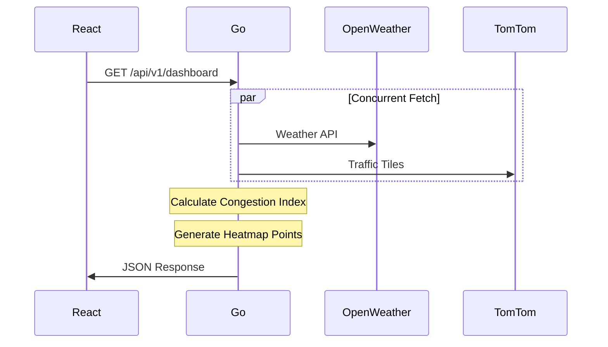
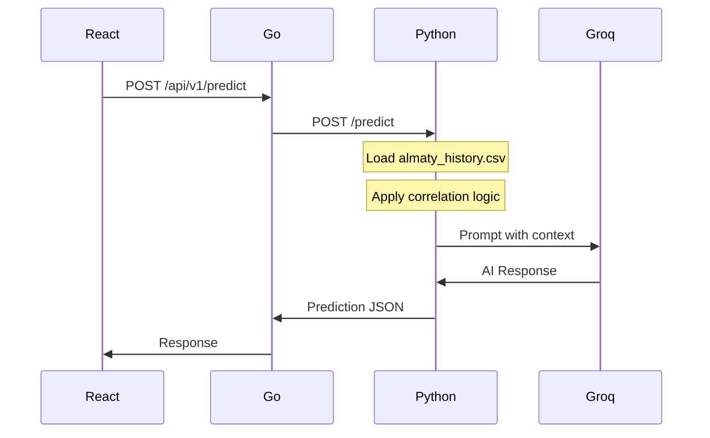

# Smart City AI Core: Almaty Urban Monitoring System

## 📋 Project Overview

A scalable, microservices-based dashboard providing:
1. **Live Monitor** - Real-time urban data visualization
2. **Trip Planner** - AI-driven predictions based on historical data

**Target City:** Almaty, Kazakhstan (43.2389°N, 76.8897°E)

---

## 🏗️ Architecture

```mermaid
graph TB
    subgraph Frontend["🖥️ Frontend<br/>React + Vite + TypeScript"]
        UI[Dashboard UI]
        DeckGL[Deck.gl Map]
        TQ[TanStack Query]
    end

    subgraph GoBackend["⚙️ Go Backend<br/>Fiber + Clean Architecture"]
        API[API Gateway :8080]
        SVC[Services Layer]
        REPO[Repository Layer]
    end

    subgraph MLService["🧠 Python ML Service<br/>FastAPI"]
        PRED[/predict :8000]
        GROQ[Groq AI Client]
        PANDAS[Pandas Logic]
    end

    subgraph External["🌐 External APIs"]
        OWM[OpenWeatherMap]
        TT[TomTom Traffic]
    end

    subgraph Infra["🗄️ Infrastructure"]
        PG[(PostgreSQL 15<br/>+ PostGIS)]
    end

    UI --> TQ --> API
    DeckGL --> API
    API --> SVC --> REPO --> PG
    SVC --> OWM
    SVC --> TT
    SVC --> PRED
    PRED --> GROQ
    PRED --> PANDAS
```

---

## 📁 Folder Structure

```
├── backend-go/                 # Go API Gateway
│   ├── cmd/server/             # Application entry point
│   ├── internal/
│   │   ├── domain/             # Entities + Interfaces (NO external deps)
│   │   ├── repository/         # Database implementations
│   │   ├── service/            # Business logic
│   │   └── delivery/http/      # HTTP handlers
│   └── pkg/utils/              # Shared utilities
│
├── ml-python/                  # Python ML Microservice
│   ├── services/               # Business logic
│   ├── tools/                  # CLI scripts
│   └── data/                   # CSV datasets
│
└── frontend-react/             # React Dashboard
    └── src/
        ├── components/
        │   ├── dashboard/      # Live data widgets
        │   └── map/            # Deck.gl visualization
        └── services/           # API client
```

### Why This Structure?

| Directory | Purpose |
|-----------|---------|
| `cmd/` | Go convention for application entry points |
| `internal/` | Private packages, not importable by external code |
| `domain/` | Pure business entities, zero external dependencies (SOLID) |
| `repository/` | Implements interfaces defined in domain (Dependency Inversion) |
| `pkg/` | Public utilities, can be imported by other projects |

---

## 🚀 Quick Start

### Prerequisites
- Docker & Docker Compose v2+
- API Keys (optional - mocks work without them)

### 1. Clone and Configure

```bash
cp .env.example .env
# Edit .env with your API keys (optional)
```

### 2. Start All Services

```bash
docker-compose up -d
```

### 3. Verify Health

```bash
# Check all containers
docker-compose ps

# API Health
curl http://localhost:8080/health
curl http://localhost:8000/health
```

### 4. Access Dashboard

Open http://localhost:3000

---

## 🔌 API Reference

### Go Backend (`:8080`)

| Endpoint | Method | Description |
|----------|--------|-------------|
| `/health` | GET | Health check |
| `/api/v1/weather` | GET | Current Almaty weather |
| `/api/v1/traffic` | GET | Traffic index + heatmap points |
| `/api/v1/dashboard` | GET | Aggregated live data |
| `/api/v1/predict` | POST | Future prediction (proxies to Python) |

### Python ML Service (`:8000`)

| Endpoint | Method | Description |
|----------|--------|-------------|
| `/health` | GET | Health check |
| `/predict` | POST | AI prediction with Groq |

---

## 🧩 Module Workflows

### Module A: Real-Time Data



### Module B: Future Planner



---

## 🎨 Design System

- **Theme:** Dark Cyberpunk
- **Primary Colors:** Cyan (`#00FFFF`), Purple (`#8B5CF6`)
- **Map Style:** Dark basemap with neon overlays
- **Font:** Inter (system fallback)

---

## 🔑 Environment Variables

| Variable | Required | Description |
|----------|----------|-------------|
| `DATABASE_URL` | Yes | PostgreSQL connection string |
| `OPENWEATHER_API_KEY` | No | OpenWeatherMap API key |
| `TOMTOM_API_KEY` | No | TomTom Maps API key |
| `GROQ_API_KEY` | No | Groq AI API key |
| `GO_ENV` | No | `development` or `production` |

> **Note:** All services return mock data when API keys are missing.

---

## 📊 Data Correlations (Almaty Context)

The ML service applies these Almaty-specific rules:

| Season | Condition | Effect |
|--------|-----------|--------|
| Winter (Dec-Feb) | Temperature < -10°C | High Smog (AQI > 150) |
| Summer (Jun-Aug) | Temperature > 30°C | Lower Traffic |
| All Year | Inversion Layer | AQI Spike |

---

## 🧪 Development

### Run Backend Locally

```bash
cd backend-go
go run cmd/server/main.go
```

### Run ML Service Locally

```bash
cd ml-python
pip install -r requirements.txt
uvicorn main:app --reload --port 8000
```

### Run Frontend Locally

```bash
cd frontend-react
npm install
npm run dev
```

---

## 📜 License

MIT License - Diploma Project 2026
