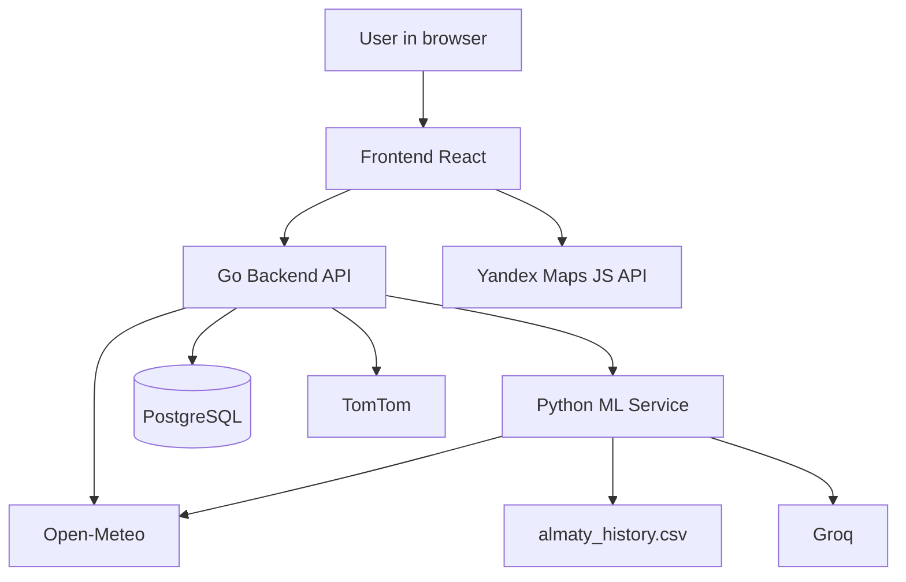
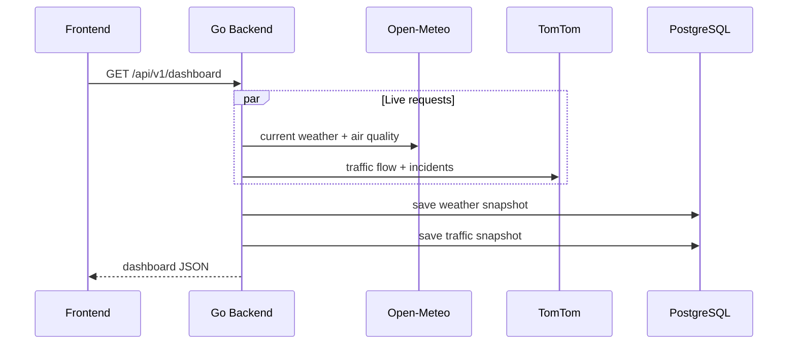
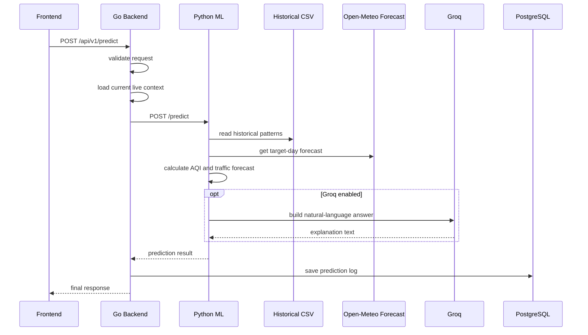
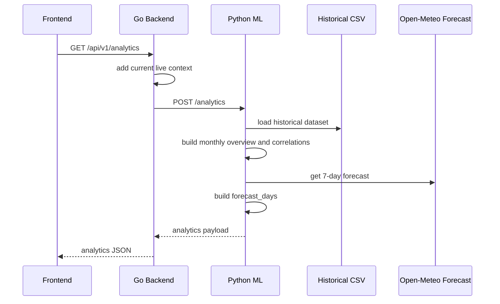

# PROJECT ARCHITECTURAL DOCUMENTATION

## 1. Цель проекта

`Smart City AI Core` — это система для наблюдения и прогнозирования городских событий в Алматы.

Проект отвечает на 3 разных вопроса:

- `Мониторинг`: что происходит в городе сейчас?
- `Планировщик`: что, скорее всего, произойдет в выбранную дату?
- `Аналитика`: какие исторические закономерности уже видны и как выглядит ближайший прогноз?

## 2. Главная идея простыми словами

В системе есть 3 типа данных:

### 1. Live data

Это данные "прямо сейчас":
- текущая погода;
- текущий AQI;
- текущий трафик;
- карта и инциденты.

### 2. Historical data

Это историческая база для дипломной аналитики:
- файл `ml-python/data/almaty_history.csv`;
- данные по Алматы с 2020 по 2026 год;
- на этих данных считаются сезонность, корреляции и месячные risk-паттерны.

### 3. Forecast data

Это данные про ближайшее будущее:
- Open-Meteo forecast на 7 дней;
- ML-прогноз AQI и трафика;
- текстовое объяснение от LLM, если включен Groq.

Ключевой принцип текущей версии:

> Историческая аналитика идет из CSV, а будущий прогноз идет из forecast + ML.  
> Поэтому аналитика не зависит от того, когда вы локально запустили проект.

## 3. Компоненты системы

| Компонент | Что делает |
|---|---|
| `Frontend React` | Показывает вкладки, графики, карту и формы |
| `Go Backend` | Собирает live-данные, валидирует запросы, общается с БД и ML |
| `Python ML Service` | Строит прогнозы, считает аналитику, работает с historical CSV |
| `PostgreSQL + PostGIS` | Хранит live snapshots и prediction logs |
| `Open-Meteo` | Дает погоду, качество воздуха и weather forecast |
| `TomTom` | Дает live traffic flow и incidents |
| `Yandex Maps JS API` | Показывает карту на фронтенде |
| `Groq` | Делает текстовый AI-ответ в Планировщике |

## 4. Простая схема

```mermaid
graph TD
    U[User in browser]
    FE[Frontend React]
    GO[Go Backend API]
    ML[Python ML Service]
    DB[(PostgreSQL)]
    CSV[almaty_history.csv]
    OM[Open-Meteo]
    TT[TomTom]
    YM[Yandex Maps JS API]
    GQ[Groq]

    U --> FE
    FE --> GO
    FE --> YM

    GO --> OM
    GO --> TT
    GO --> DB
    GO --> ML

    ML --> CSV
    ML --> OM
    ML --> GQ
```

## 5. Кто за что отвечает

### Frontend

Frontend:
- показывает `Мониторинг`, `Аналитику`, `Планировщик`;
- строит графики;
- отправляет запросы в backend;
- отображает карту Яндекс;
- не считает сложную логику сам.

То есть фронтенд — это слой отображения.

### Go Backend

Go backend:
- получает запросы от фронта;
- забирает текущие weather/traffic данные;
- сохраняет live snapshots в PostgreSQL;
- обогащает запросы к ML service текущим контекстом;
- возвращает единый JSON-ответ фронту.

То есть backend — это центральный координатор.

### Python ML Service

ML service:
- читает historical CSV;
- строит monthly statistics и correlations;
- берет weather forecast на 7 дней;
- считает AQI и traffic forecast;
- отдает payload для аналитики;
- по запросу формирует текстовый ответ через Groq.

То есть ML service — это слой прогнозов и аналитики.

### PostgreSQL

База хранит:
- `weather_data`
- `traffic_data`
- `heatmap_snapshots`
- `prediction_logs`

Важно:
- база не является главным источником исторической аналитики;
- она нужна для live snapshots и логов;
- исторические графики теперь не зависят от session-history в БД.

## 6. Как работает каждая вкладка

## 6.1 Мониторинг

### Что показывает

- текущую погоду;
- текущий AQI;
- текущий трафик;
- карту города.

### Как идет поток данных

```mermaid
sequenceDiagram
    participant FE as Frontend
    participant GO as Go Backend
    participant OM as Open-Meteo
    participant TT as TomTom
    participant DB as PostgreSQL

    FE->>GO: GET /api/v1/dashboard
    par Live requests
        GO->>OM: current weather + air quality
        GO->>TT: traffic flow + incidents
    end
    GO->>DB: save weather snapshot
    GO->>DB: save traffic snapshot
    GO-->>FE: dashboard JSON
```

### Что важно понимать

- это именно live-monitoring;
- здесь данные могут быть реальными или mock, если API недоступен;
- эти данные не должны подменять собой историческую аналитику.

## 6.2 Планировщик

### Что делает

Пользователь задает вопрос про выбранную дату:
- "Нужна ли маска в субботу?"
- "Когда лучше выехать завтра?"
- "Какие будут пробки вечером?"

### Как идет поток данных

```mermaid
sequenceDiagram
    participant FE as Frontend
    participant GO as Go Backend
    participant ML as Python ML
    participant CSV as Historical CSV
    participant OM as Open-Meteo Forecast
    participant GQ as Groq
    participant DB as PostgreSQL

    FE->>GO: POST /api/v1/predict
    GO->>GO: validate request
    GO->>GO: load current live context
    GO->>ML: POST /predict
    ML->>CSV: read historical patterns
    ML->>OM: get target-day forecast
    ML->>ML: calculate AQI and traffic forecast
    opt Groq enabled
        ML->>GQ: build natural-language answer
        GQ-->>ML: explanation text
    end
    ML-->>GO: prediction result
    GO->>DB: save prediction log
    GO-->>FE: final response
```

### Самое важное изменение

Раньше будущий прогноз мог частично опираться на текущую температуру.

Теперь логика исправлена:
- для будущих дат используется `forecast выбранного дня`;
- текущая температура нужна только как live context для "сегодня";
- численные значения строятся моделью, а не LLM.

### Роль LLM

LLM не придумывает числа для графиков.

LLM делает только:
- человекочитаемый ответ;
- объяснение прогноза;
- рекомендации пользователю.

Численные поля `aqi_prediction` и `traffic_index_prediction` считает ML service.

## 6.3 Аналитика

### Что показывает

Новая аналитика строится из двух источников:

- `historical CSV`
- `7-day forecast`

Во вкладке теперь есть:
- 7-дневный прогноз AQI и traffic;
- monthly overview risk events;
- сезонная связь температуры и AQI.

### Как идет поток данных

```mermaid
sequenceDiagram
    participant FE as Frontend
    participant GO as Go Backend
    participant ML as Python ML
    participant CSV as Historical CSV
    participant OM as Open-Meteo Forecast

    FE->>GO: GET /api/v1/analytics
    GO->>GO: add current live context
    GO->>ML: POST /analytics
    ML->>CSV: load historical dataset
    ML->>ML: build monthly overview and correlations
    ML->>OM: get 7-day forecast
    ML->>ML: build forecast_days
    ML-->>GO: analytics payload
    GO-->>FE: analytics JSON
```

### Почему это правильнее для диплома

Потому что:
- аналитика больше не "начинается с нуля" после запуска;
- исторические графики стабильны;
- прогноз на будущее строится отдельно;
- разделы проекта больше не смешивают live-данные и history.

## 7. Какие данные хранятся где

## 7.1 PostgreSQL

Используется для:
- live snapshots;
- prediction logs;
- текущих history endpoints backend;
- служебных данных приложения.

Таблицы:
- `weather_data`
- `traffic_data`
- `heatmap_snapshots`
- `prediction_logs`

## 7.2 CSV datasets

Основной runtime dataset:
- `ml-python/data/almaty_history.csv`

Архивные файлы:
- `almaty_history_backup.csv`
- `almaty_history_pre_epa2024.csv`

Практический смысл:
- runtime-логика должна опираться на `almaty_history.csv`;
- остальные файлы нужны как backup/provenance, а не как главный источник аналитики.

## 7.3 Forecast cache

ML service кэширует forecast в памяти примерно на 1 час, чтобы:
- не дергать Open-Meteo слишком часто;
- быстрее отвечать на повторные запросы.

## 8. Почему аналитика больше не обнуляется

Старая проблема была такой:
- приложение локально запускалось;
- backend писал weather/traffic в БД только во время работы;
- графики зависели от того, сколько времени система прожила после старта.

Новая схема:
- live snapshots по-прежнему пишутся в БД;
- но аналитика на вкладке строится не из этих snapshots;
- аналитика строится из historical CSV и forecast.

Именно поэтому после перезапуска:
- live widgets обновляются заново;
- а аналитика остается осмысленной.

## 9. Почему это не overengineering

Система специально разделена просто:

- `Мониторинг` = live
- `Планировщик` = future forecast
- `Аналитика` = history + short-term outlook

Мы не добавляли тяжелый scheduler и не строили продовый data warehouse.

Для диплома это хороший компромисс:
- архитектура понятная;
- логика честная;
- данные не захардкожены вручную в графиках;
- модель использует реальный historical dataset и forecast API.

## 10. Когда включается demo/mock режим

### Трафик

Трафик может уйти в mock/simulation, если:
- нет `TOMTOM_API_KEY`;
- TomTom API недоступен;
- backend не смог получить live traffic.

### Planner

`is_mock=true` в прогнозе обычно означает, что:
- недоступен ML service;
- нет нормального historical data;
- backend вернул fallback.

### Analytics

Аналитика работает даже без TomTom и Groq, если:
- ML service поднят;
- `almaty_history.csv` доступен.

## 11. Основные endpoints и их роль

### Backend

| Endpoint | Роль |
|---|---|
| `/api/v1/dashboard` | live monitor |
| `/api/v1/weather` | current weather + AQI |
| `/api/v1/traffic` | current traffic |
| `/api/v1/predict` | planner |
| `/api/v1/analytics` | analytics |
| `/api/v1/stats` | technical stats |

### ML service

| Endpoint | Роль |
|---|---|
| `/predict` | numeric forecast + optional LLM text |
| `/analytics` | historical analytics + 7-day forecast |
| `/stats` | monthly stats, correlations, model info |
| `/model/info` | diagnostics |
| `/model/retrain` | retraining |

Важно:
- backend endpoint `/api/v1/analytics` — это `GET`, потому что фронту так удобно;
- внутри backend делает enrichment и вызывает ML endpoint `/analytics` через `POST`.

## 12. Где искать логику в коде

| Задача | Основные файлы |
|---|---|
| Backend routes | `backend-go/internal/delivery/http/router.go` |
| Backend handlers | `backend-go/internal/delivery/http/handlers.go` |
| ML bridge | `backend-go/internal/service/ml_bridge.go` |
| Prediction logic | `ml-python/services/logic.py` |
| Forecast logic | `ml-python/services/forecast.py` |
| Historical dataset | `ml-python/data/almaty_history.csv` |
| Analytics UI | `frontend-react/src/components/analytics/` |
| Planner UI | `frontend-react/src/components/dashboard/TripPlanner.tsx` |
| API client | `frontend-react/src/services/api.ts` |

## 13. Важные технические договоренности

- Временная зона для логики forecast и future dates: `Asia/Almaty`.
- Фронтенд работает через same-origin API.
- Яндекс Карты загружаются на стороне браузера.
- Численные графики не должны зависеть от LLM.
- Историческая аналитика должна строиться из CSV, а не из session data.

## 14. Как объяснить архитектуру за 30 секунд

Можно сказать так:

> У нас есть frontend, Go backend и Python ML service.  
> Мониторинг показывает live-состояние города через внешние API.  
> Планировщик прогнозирует события на выбранную дату через historical CSV и weather forecast.  
> Аналитика показывает исторические закономерности по Алматы и ближайший 7-дневный прогноз.  
> Поэтому проект работает локально стабильно и не требует реального продового накопления данных.
