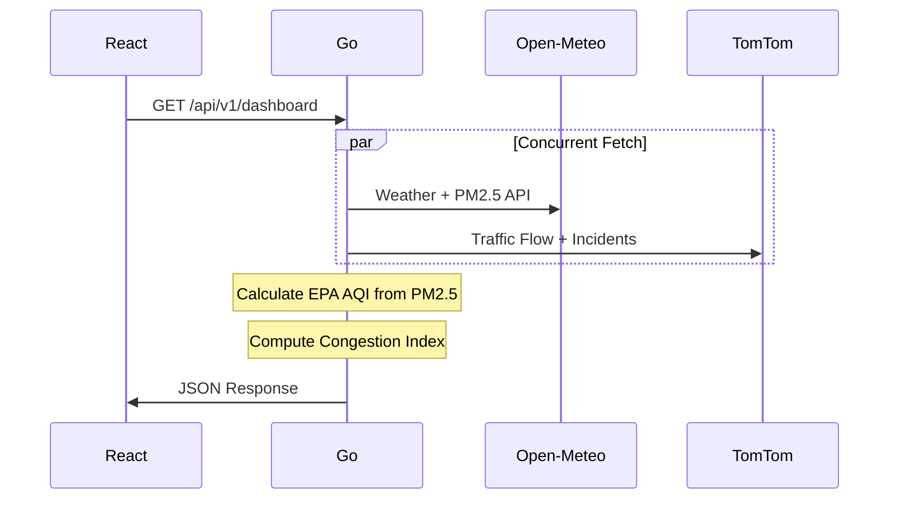
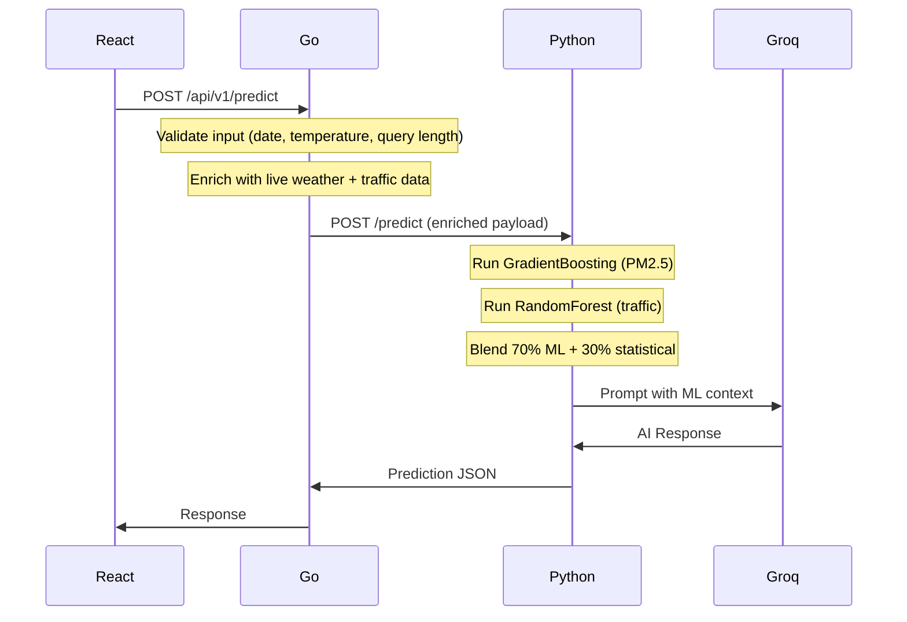

# Smart City AI Core: Almaty Urban Monitoring System

## Project Overview

A scalable, microservices-based dashboard providing:
1. **Live Monitor** -- Real-time urban data visualization (weather, traffic, AQI)
2. **Analytics** -- Historical charts with real API data
3. **Trip Planner** -- AI-driven predictions using ML models and Groq LLM

**Target City:** Almaty, Kazakhstan (43.2389N, 76.8897E)

---

## Architecture

```mermaid
graph TB
    subgraph Frontend["Frontend<br/>React + Vite + TypeScript"]
        UI[Dashboard UI]
        YMaps[Yandex Maps 2.1]
        TQ[TanStack Query]
    end

    subgraph GoBackend["Go Backend<br/>Fiber + Clean Architecture"]
        API[API Gateway :8080]
        SVC[Services Layer]
        REPO[Repository Layer]
    end

    subgraph MLService["Python ML Service<br/>FastAPI + scikit-learn"]
        PRED[/predict :8000]
        GROQ[Groq AI Client]
        SKLEARN[ML Models]
    end

    subgraph External["External APIs"]
        OM[Open-Meteo]
        TT[TomTom Traffic]
        YA[Yandex Maps JS API]
    end

    subgraph Infra["Infrastructure"]
        PG[(PostgreSQL 15<br/>+ PostGIS)]
    end

    UI --> TQ --> API
    YMaps --> YA
    API --> SVC --> REPO --> PG
    SVC --> OM
    SVC --> TT
    SVC --> PRED
    PRED --> GROQ
    PRED --> SKLEARN
```

---

## Folder Structure

```
antigravity_smartcity/
├── .github/workflows/          # CI/CD
│   └── ci.yml                  # 4-job pipeline (Go, Python, Frontend, Docker)
│
├── backend-go/                 # Go API Gateway
│   ├── cmd/server/             # Application entry point
│   ├── internal/
│   │   ├── domain/             # Entities + Interfaces (NO external deps)
│   │   ├── repository/         # PostgreSQL + Mock implementations
│   │   ├── service/            # Business logic + tests (32 test cases)
│   │   └── delivery/http/      # HTTP handlers + router
│   └── pkg/utils/              # Shared utilities (haversine, clamp, lerp)
│
├── ml-python/                  # Python ML Microservice
│   ├── main.py                 # FastAPI application
│   ├── services/
│   │   ├── logic.py            # Predictions, Groq LLM, statistics
│   │   ├── ml_model.py         # scikit-learn models, EPA AQI calculation
│   │   └── forecast.py         # Open-Meteo forecast fetching
│   ├── tests/                  # Pytest tests (36 test cases)
│   ├── models/                 # Trained .pkl files (gitignored)
│   ├── data/                   # almaty_history.csv (2234 days)
│   └── tools/                  # Data generation scripts
│
├── frontend-react/             # React Dashboard
│   ├── src/
│   │   ├── components/
│   │   │   ├── dashboard/      # WeatherWidget, TrafficWidget, AQI, TripPlanner
│   │   │   ├── analytics/      # AQIHistoryChart, TrafficByHourChart, CorrelationChart
│   │   │   └── map/            # AlmatyMap (Yandex Maps integration)
│   │   ├── __tests__/          # Vitest tests (7 test cases)
│   │   ├── locales/            # ru.ts, en.ts, kk.ts
│   │   └── services/           # API client + fallback mock
│   └── nginx.conf              # Nginx configuration
│
├── migrations/                 # 001_init.sql (PostGIS + tables)
├── docker-compose.yml          # 4 services
├── Makefile                    # Management commands (up, down, test, lint)
└── .env.example                # Environment variables template
```

### Why This Structure?

| Directory | Purpose |
|-----------|---------|
| `cmd/` | Go convention for application entry points |
| `internal/` | Private packages, not importable by external code |
| `domain/` | Pure business entities, zero external dependencies (SOLID) |
| `repository/` | Implements interfaces defined in domain (Dependency Inversion) |
| `service/` | Business logic with unit tests |
| `pkg/` | Public utilities, can be imported by other projects |

---

## Quick Start

### Prerequisites
- Docker & Docker Compose v2+
- API Keys (optional -- mocks work without them)

### 1. Clone and Configure

```bash
git clone https://github.com/Beksanoff/smart-city-ai.git
cd smart-city-ai
cp .env.example .env
# Edit .env with your API keys (optional)
```

### 2. Start All Services

```bash
docker compose up -d --build
# or: make up
```

### 3. Verify Health

```bash
docker compose ps              # All 4 should be "Up (healthy)"
curl http://localhost:8080/health
curl http://localhost:8000/health
```

### 4. Access Dashboard

Open http://localhost:3000

---

## API Reference

### Go Backend (`:8080`)

| Endpoint | Method | Description |
|----------|--------|-------------|
| `/health` | GET | Health check |
| `/api/v1/dashboard` | GET | Aggregated live data (weather + traffic) |
| `/api/v1/weather` | GET | Current Almaty weather + AQI |
| `/api/v1/traffic` | GET | Traffic: 24 segments, incidents, congestion index |
| `/api/v1/history/weather?hours=N` | GET | Weather history for N hours (max 720) |
| `/api/v1/history/traffic?hours=N` | GET | Traffic history for N hours |
| `/api/v1/predict` | POST | AI prediction (proxied to ML Service) |
| `/api/v1/stats` | GET | Statistics (proxied to ML Service) |

### Python ML Service (`:8000`)

| Endpoint | Method | Description |
|----------|--------|-------------|
| `/health` | GET | Health check |
| `/predict` | POST | AI prediction (Groq LLM + ML models + statistics) |
| `/stats` | GET | Monthly averages, correlations, 2234-day dataset |
| `/model/info` | GET | ML model metrics (R², MAE, training date) |
| `/model/retrain` | POST | Retrain ML models from historical data |

---

## Module Workflows

### Module A: Real-Time Data


```mermaid
sequenceDiagram
    participant React
    participant Go
    participant OpenMeteo as Open-Meteo
    participant TomTom

    React->>Go: GET /api/v1/dashboard
    par Concurrent Fetch
        Go->>OpenMeteo: Weather + PM2.5 API
        Go->>TomTom: Traffic Flow + Incidents
    end
    Note over Go: Calculate EPA AQI from PM2.5
    Note over Go: Compute Congestion Index
    Go->>React: JSON Response
```

### Module B: AI Prediction


```mermaid
sequenceDiagram
    participant React
    participant Go
    participant Python
    participant Groq

    React->>Go: POST /api/v1/predict
    Note over Go: Validate input (date, temperature, query length)
    Note over Go: Enrich with live weather + traffic data
    Go->>Python: POST /predict (enriched payload)
    Note over Python: Run GradientBoosting (PM2.5)
    Note over Python: Run RandomForest (traffic)
    Note over Python: Blend 70% ML + 30% statistical
    Python->>Groq: Prompt with ML context
    Groq->>Python: AI Response
    Python->>Go: Prediction JSON
    Go->>React: Response
```

---

## ML Models

### PM2.5 Prediction (GradientBoosting)
- **R²:** 0.5273 (CV: 0.2942 +/- 0.4282)
- **Features:** temperature, humidity, wind_speed, month, day_of_week, is_winter
- **Scaler:** Separate `pm25_scaler` (StandardScaler)

### Traffic Prediction (RandomForest)
- **R²:** 0.7663 (CV: 0.7464 +/- 0.0138)
- **Features:** hour, day_of_week, month, temperature, is_rush_hour
- **Scaler:** Separate `traffic_scaler` (StandardScaler)

### AQI Calculation
- **Standard:** EPA 2024 breakpoints
- **Input:** PM2.5 concentration
- **Fix:** `math.floor(pm25 * 10) / 10` truncation to handle breakpoint gap at 9.0-9.1

### Prediction Blending
Final prediction = 70% ML model output + 30% statistical baseline (monthly averages from 2234-day dataset)

---

## Design System

- **Theme:** Dark Cyberpunk
- **Primary Colors:** Cyan (`#00FFFF`), Purple (`#8B5CF6`)
- **Map:** Yandex Maps with real-time traffic overlay
- **Font:** Inter (system fallback)

---

## Environment Variables

| Variable | Required | Description |
|----------|----------|-------------|
| `POSTGRES_USER` | Yes | PostgreSQL username (default: `smartcity`) |
| `POSTGRES_PASSWORD` | Yes | PostgreSQL password |
| `POSTGRES_DB` | Yes | Database name (default: `smartcity_db`) |
| `TOMTOM_API_KEY` | No | TomTom Traffic API key |
| `YANDEX_MAPS_API_KEY` | No | Yandex Maps JS API key |
| `GROQ_API_KEY` | No | Groq AI API key |
| `GO_ENV` | No | `development` or `production` |

> **Note:** Weather and AQI data come from **Open-Meteo** (free, no API key needed). All services return mock data when API keys are missing.

---

## Testing

| Service | Framework | Tests | Command |
|---------|-----------|-------|---------|
| Go Backend | `go test` | 32 | `cd backend-go && go test ./... -v` |
| Python ML | pytest | 36 | `cd ml-python && python -m pytest tests/ -v` |
| Frontend | Vitest + Testing Library | 7 | `cd frontend-react && npx vitest run` |
| **All** | -- | **75** | `make test` |

### What is tested:
- **Go:** EPA AQI calculation (`pm25ToAQI`), boundary values, monotonicity, all ranges
- **Python:** AQI unit tests (7 EPA categories), `/health` endpoint, `/predict` validation, edge cases
- **Frontend:** Header rendering, tab navigation, language switcher, footer

---

## CI/CD

GitHub Actions pipeline (`.github/workflows/ci.yml`) runs on push/PR to `main`:

| Job | Steps |
|-----|-------|
| **Go Tests** | Setup Go 1.22, `go test ./...` |
| **Python Tests** | Setup Python 3.12, install deps, `pytest` |
| **Frontend** | Setup Node 20, `npm ci`, ESLint, TypeScript check, Vitest |
| **Docker Build** | Build all 4 container images |

---

## Data Correlations (Almaty Context)

The ML service applies these Almaty-specific rules:

| Season | Condition | Effect |
|--------|-----------|--------|
| Winter (Dec-Feb) | Temperature < -10C | High Smog (AQI > 150) |
| Summer (Jun-Aug) | Temperature > 30C | Lower Traffic |
| All Year | Inversion Layer | AQI Spike |
| Rush Hours | 07:00-09:00, 17:00-19:00 | Traffic Index > 70 |

Historical dataset: 2234 days of real Almaty data (Open-Meteo Archive, 2020-2026).

---

## Development

### Run Backend Locally
```bash
cd backend-go
go mod download
go run cmd/server/main.go
```

### Run ML Service Locally
```bash
cd ml-python
python -m venv venv
source venv/bin/activate
pip install -r requirements.txt
uvicorn main:app --reload --port 8000
```

### Run Frontend Locally
```bash
cd frontend-react
npm install
npm run dev
```

---

## License

MIT License -- Diploma Project 2026
