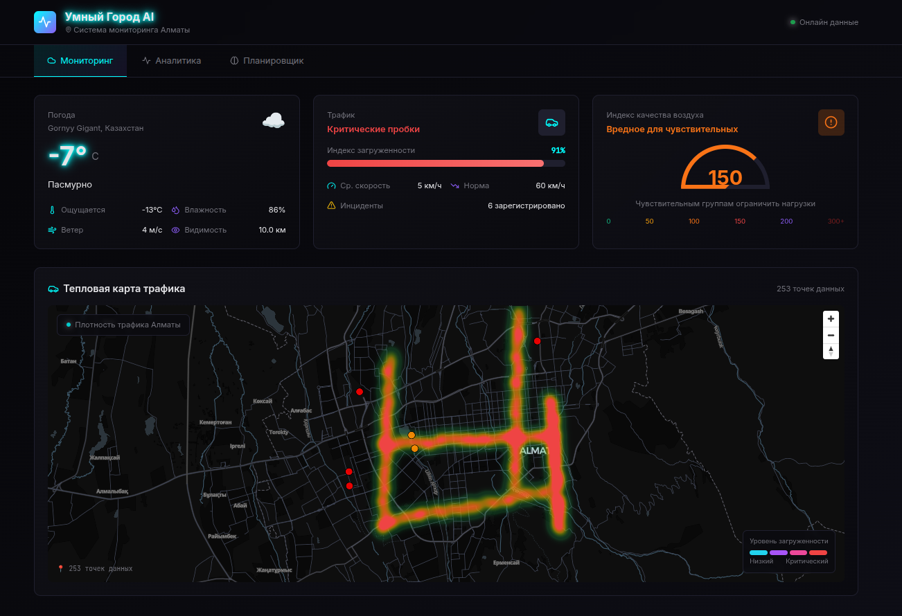
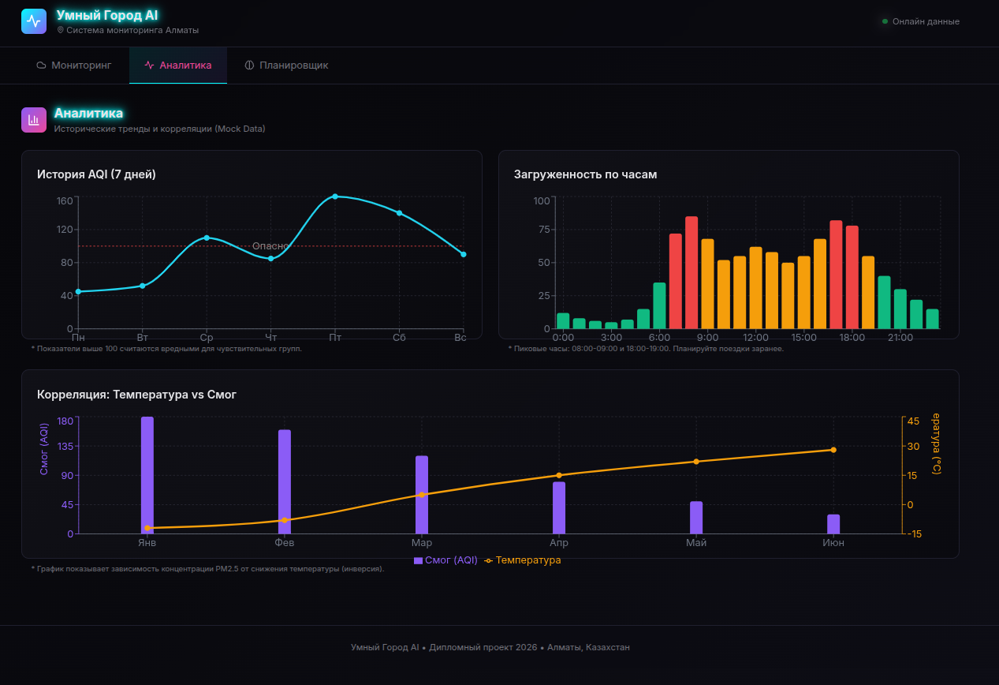
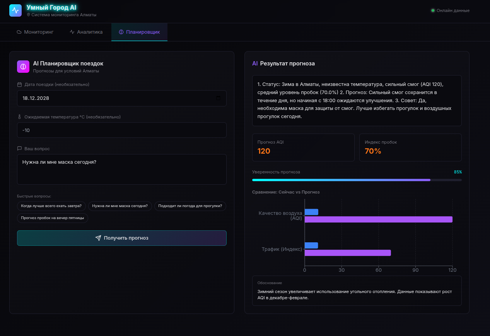

# 🌆 Smart City AI Core | Almaty Urban Monitoring System

**Умная городская система мониторинга с AI-прогнозами для города Алматы**

Дипломный проект, демонстрирующий интеграцию микросервисной архитектуры, машинного обучения и современных веб-технологий для создания системы мониторинга городской среды.


---

## 📋 Содержание

- [Возможности](#-возможности)
- [Архитектура](#-архитектура)
- [Быстрый старт](#-быстрый-старт)
- [Технологии](#-технологии)
- [API Документация](#-api-документация)
- [Разработка](#-разработка)
- [Скриншоты](#-скриншоты)

---

## ✨ Возможности

### Мониторинг в реальном времени
- 🌡️ **Погода** — температура, влажность, ветер, видимость
- 🚗 **Трафик** — индекс загруженности дорог, средняя скорость, инциденты
- 🌫️ **Качество воздуха (AQI)** — мониторинг загрязнения воздуха с визуальной индикацией

### AI Планировщик поездок
- 🧠 **Прогнозы на основе Groq AI** — умные рекомендации для поездок
- 📊 **Корреляционный анализ** — учёт температуры, сезонности, дня недели
- 💬 **Интерактивный чат** — задавайте вопросы на естественном языке

### Визуализация данных
- 🗺️ **Интерактивная карта** — тепловая карта трафика Алматы на базе MapLibre GL
- 📈 **Real-time виджеты** — адаптивный дашборд с киберпанк-дизайном
- 🌐 **Русский интерфейс** — полная локализация

### Режим работы
- ⚡ **Mock-данные** — система работает без API-ключей в демо-режиме
- 🔌 **Интеграция с API** — поддержка OpenWeather, TomTom, Groq

---

## 🏗️ Архитектура

```
┌─────────────────┐       ┌─────────────────┐       ┌─────────────────┐
│   Frontend      │──────▶│   Backend Go    │──────▶│  ML Service     │
│   React + Vite  │       │   Fiber API     │       │  Python+FastAPI │
│   Deck.gl Map   │       │   Clean Arch    │       │  Groq AI        │
└─────────────────┘       └─────────────────┘       └─────────────────┘
         │                         │                         │
         │                         │                         │
         └─────────────────┬───────┴─────────────────────────┘
                           │
                    ┌──────▼──────┐
                    │  PostgreSQL │
                    │  + PostGIS  │
                    └─────────────┘
```

### Сервисы

| Сервис | Порт | Технология | Назначение |
|--------|------|------------|------------|
| **Frontend** | 3000 | React 18 + TypeScript + Nginx | UI дашборд, карты |
| **Backend** | 8080 | Go (Fiber) + pgx | API Gateway, бизнес-логика |
| **ML Service** | 8000 | Python 3.11 + FastAPI | AI-прогнозы, корреляции |
| **Database** | 5432 | PostgreSQL 15 + PostGIS | Хранение данных |

---

## 🚀 Быстрый старт

### Требования
- Docker 20.10+
- Docker Compose v2+
- make (опционально)

### 1. Клонируйте репозиторий
```bash
git clone https://github.com/<your-username>/antigravity_smartcity.git
cd antigravity_smartcity
```

### 2. Настройте переменные окружения
```bash
cp .env.example .env
# Отредактируйте .env если нужны реальные API-ключи
```

### 3. Запустите проект
```bash
# С Make (рекомендуется)
make up

# Или вручную
sudo docker compose up -d --build
```

### 4. Откройте приложение
```
🌐 Frontend: http://localhost:3000
📡 Backend API: http://localhost:8080
🤖 ML Service: http://localhost:8000
```

### Управление проектом
```bash
make up       # Запустить все сервисы
make down     # Остановить все сервисы
make restart  # Перезапустить
make logs     # Просмотр логов
make clean    # Полная очистка (удалить volumes)
make status   # Статус контейнеров
```

---

## 🛠️ Технологии

### Backend (Go)
- **Fiber** — веб-фреймворк
- **pgx** — PostgreSQL драйвер
- **Clean Architecture** — разделение на domain/service/repository/delivery
- **Dependency Injection** — инверсия зависимостей

### ML Service (Python)
- **FastAPI** — асинхронный API
- **Groq AI SDK** — интеграция с LLM
- **Pandas** — обработка данных
- **Uvicorn** — ASGI сервер

### Frontend (React)
- **Vite** — сборщик
- **TypeScript** — типизация
- **TailwindCSS** — стилизация
- **TanStack Query** — управление состоянием API
- **Deck.gl + MapLibre** — интерактивные карты
- **Lucide React** — иконки

### Infrastructure
- **Docker + Docker Compose** — контейнеризация
- **Nginx** — reverse proxy для фронтенда
- **PostgreSQL + PostGIS** — база данных с геопространственными возможностями

---

## 📚 API Документация

### Backend Endpoints

#### Health Check
```http
GET /health
```

#### Dashboard
```http
GET /api/v1/dashboard
```
Возвращает агрегированные данные о погоде, трафике и качестве воздуха.

#### Weather
```http
GET /api/v1/weather
```

#### Traffic
```http
GET /api/v1/traffic
```
Возвращает данные о трафике + 30 точек для тепловой карты.

### ML Service Endpoints

#### Prediction
```http
POST /predict
Content-Type: application/json

{
  "date": "2026-02-15",
  "temperature": -10,
  "query": "Когда лучше всего ехать завтра?"
}
```

---

## 🔧 Разработка

### Локальный запуск без Docker

#### Backend (Go)
```bash
cd backend-go
go mod download
go run cmd/server/main.go
```

#### ML Service (Python)
```bash
cd ml-python
python -m venv venv
source venv/bin/activate  # Windows: venv\Scripts\activate
pip install -r requirements.txt
uvicorn app:app --reload --port 8000
```

#### Frontend (React)
```bash
cd frontend-react
npm install
npm run dev
```

### Структура проекта
```
antigravity_smartcity/
├── backend-go/           # Go API Gateway
│   ├── cmd/             # Точка входа
│   ├── internal/        # Бизнес-логика
│   │   ├── domain/      # Доменные сущности
│   │   ├── repository/  # Слой данных
│   │   ├── service/     # Бизнес-логика
│   │   └── delivery/    # HTTP handlers
│   └── pkg/             # Утилиты
├── ml-python/           # ML микросервис
│   ├── app.py          # FastAPI приложение
│   ├── services/       # AI/ML логика
│   └── tools/          # Генерация данных
├── frontend-react/      # React UI
│   ├── src/
│   │   ├── components/  # React компоненты
│   │   └── services/    # API клиент
│   └── nginx.conf       # Nginx конфигурация
├── migrations/          # SQL миграции
├── docker-compose.yml   # Docker Compose
├── Makefile            # Команды управления
└── README.md           # Этот файл
```

---

## 🎨 Скриншоты

### Дашборд мониторинга


### Тепловая карта трафика


### AI Планировщик



---

## 🌐 API-ключи (опционально)

Проект работает **без API-ключей** в демо-режиме. Для реальных данных зарегистрируйтесь:

### OpenWeatherMap (погода)
1. Регистрация: https://openweathermap.org/appid
2. Добавьте в `.env`: `OPENWEATHER_API_KEY=your_key`

### TomTom (трафик)
1. Регистрация: https://developer.tomtom.com
2. Добавьте в `.env`: `TOMTOM_API_KEY=your_key`

### Groq AI (LLM)
1. Регистрация: https://console.groq.com
2. Добавьте в `.env`: `GROQ_API_KEY=your_key`

---

## 📝 Лицензия

MIT License - смотрите файл [LICENSE](LICENSE)

---

## 👨‍💻 Автор

**Дипломный проект 2026**
- 📧 Email: your.email@example.com
- 🎓 Университет: [Название университета]
- 🏙️ Город: Алматы, Казахстан

---

## 🙏 Благодарности

- [OpenWeatherMap](https://openweathermap.org) — API погоды
- [TomTom](https://developer.tomtom.com) — API трафика
- [Groq](https://groq.com) — AI инфраструктура
- [CARTO](https://carto.com) — бесплатные тайлы карт

---

**Сделано с ❤️ для улучшения городской среды Алматы**
