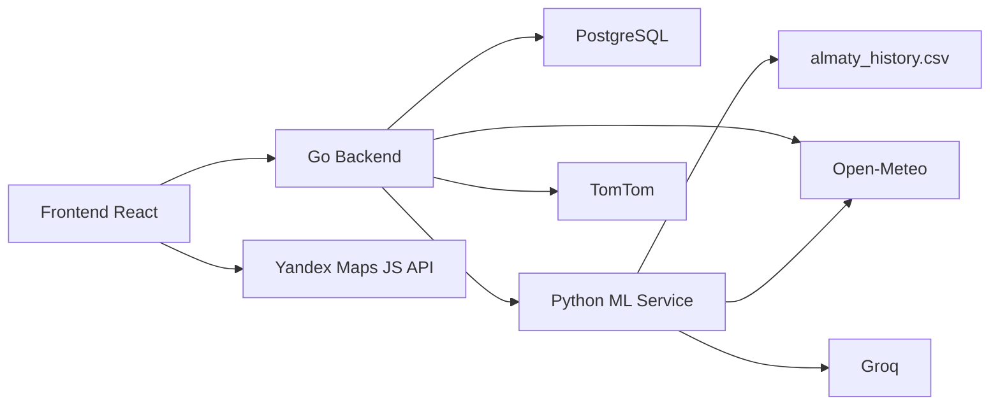

# Smart City AI Core

Дипломный проект по прогнозированию городских событий для Алматы.

Проект состоит из 3 смысловых частей:
- `Мониторинг` показывает, что происходит в городе сейчас.
- `Планировщик` отвечает на вопрос пользователя про выбранную дату.
- `Аналитика` показывает исторические закономерности и ближайший 7-дневный прогноз.

## Что изменено в текущей версии

- Аналитика больше не зависит от локального накопления данных после запуска приложения.
- Источник аналитики: `ml-python/data/almaty_history.csv`.
- Прогноз на будущую дату теперь использует погоду выбранного дня, а не текущую температуру.
- LLM больше не используется для чисел на графиках.
- LLM нужен только для текстового объяснения в Планировщике.

Это важно для локального запуска: после перезапуска проекта графики аналитики не обнуляются, потому что строятся по историческому CSV.

## Что умеет система

### 1. Мониторинг

- Погода, влажность, ветер, видимость и AQI.
- Трафик, загруженность дорог и инциденты.
- Карта Алматы с Яндекс Картами.

Источники:
- Погода и качество воздуха: Open-Meteo / Open-Meteo Air Quality.
- Трафик: TomTom.
- Карта и визуальный слой пробок: Yandex Maps JS API.

### 2. Планировщик

Пользователь задает вопрос, например:
- когда лучше выехать;
- нужна ли маска;
- как будут выглядеть пробки в выбранный день.

Что происходит внутри:
- фронтенд отправляет дату и вопрос;
- Go backend добавляет текущий контекст города;
- Python ML service берет исторический CSV и forecast выбранного дня;
- модель считает AQI и traffic index;
- Groq, если включен, формирует человекочитаемый ответ.

Если Groq отключен, проект все равно выдает численный прогноз и короткий текстовый fallback.

### 3. Аналитика

Аналитика теперь разделена на 2 типа данных:

- `Historical analytics` из `almaty_history.csv`
- `Forecast analytics` на ближайшие 7 дней

В результате вкладка показывает:
- 7-дневный прогноз AQI, трафика и интегрального risk score;
- месячную частоту риск-событий по историческому датасету;
- сезонную связь температуры и AQI.

## Архитектура в одном взгляде


```mermaid
graph LR
    A[Frontend React] --> B[Go Backend]
    B --> C[PostgreSQL]
    B --> D[Python ML Service]
    B --> E[Open-Meteo]
    B --> F[TomTom]
    A --> G[Yandex Maps JS API]
    D --> H[almaty_history.csv]
    D --> E
    D --> I[Groq]
```

Коротко:
- `Frontend` показывает интерфейс.
- `Go Backend` собирает live-данные и проксирует AI-запросы.
- `Python ML Service` считает прогнозы и аналитику.
- `PostgreSQL` хранит live snapshots и логи прогнозов.
- `CSV` хранит историческую базу для аналитики и ML.

## Какие данные откуда берутся

| Что показываем | Источник |
|---|---|
| Текущая погода | Open-Meteo |
| Текущий AQI | Open-Meteo Air Quality + расчет AQI |
| Текущий трафик | TomTom |
| Карта | Yandex Maps JS API |
| Историческая аналитика | `ml-python/data/almaty_history.csv` |
| Будущий прогноз | ML + historical CSV + Open-Meteo forecast |
| Текстовый AI-ответ | Groq, если ключ задан |

## Быстрый старт

### 1. Подготовьте `.env`

```bash
cp .env.example .env
```

Минимально нужны настройки БД.

Для полного режима желательно заполнить:
- `TOMTOM_API_KEY`
- `GROQ_API_KEY`
- `YANDEX_MAPS_API_KEY`

Важно:
- `Open-Meteo` не требует ключа.
- `OPENWEATHER_API_KEY` в текущей архитектуре не нужен для основной логики и может оставаться пустым.

### 2. Запустите проект

```bash
docker compose up -d --build
```

Если вы меняли `POSTGRES_*` и до этого уже запускали проект, лучше сделать чистый перезапуск:

```bash
docker compose down -v
docker compose up -d --build
```

### 3. Проверьте контейнеры

```bash
docker compose ps
```

Ожидаемые сервисы:
- `smartcity-db`
- `smartcity-ml`
- `smartcity-backend`
- `smartcity-frontend`

### 4. Откройте приложение

- Frontend: `http://localhost:3000`
- Backend API: `http://localhost:8080`
- ML service: `http://localhost:8000`

## Режимы работы

### Полный режим

Если есть все ключи и внешний интернет:
- мониторинг работает на live-данных;
- Planner выдает нормальный AI-ответ;
- Analytics работает на CSV + forecast.

### Частичный режим

Если нет части ключей:
- без `TOMTOM_API_KEY` трафик уходит в simulation/mock;
- без `GROQ_API_KEY` текст AI-ответа становится упрощенным;
- без `YANDEX_MAPS_API_KEY` карта может не загрузиться.

### Что не ломается даже без ключей

- историческая аналитика из CSV;
- сезонные графики;
- базовый численный прогноз, если работает ML service.

## Основные API endpoints

### Backend `:8080`

| Метод | Endpoint | Назначение |
|---|---|---|
| `GET` | `/health` | Health check |
| `GET` | `/api/v1/dashboard` | Live weather + live traffic |
| `GET` | `/api/v1/weather` | Текущая погода и AQI |
| `GET` | `/api/v1/traffic` | Текущий трафик |
| `POST` | `/api/v1/predict` | Планировщик / прогноз для выбранной даты |
| `GET` | `/api/v1/analytics` | Историческая аналитика + 7-дневный прогноз |
| `GET` | `/api/v1/stats` | Статистика модели и датасета |

### ML service `:8000`

| Метод | Endpoint | Назначение |
|---|---|---|
| `GET` | `/health` | Health check |
| `POST` | `/predict` | Численный прогноз + LLM-текст |
| `POST` | `/analytics` | Историческая аналитика + 7-day forecast payload |
| `GET` | `/stats` | Monthly stats, correlations, model info |
| `GET` | `/model/info` | Информация о модели |
| `POST` | `/model/retrain` | Переобучение модели |

## Как устроены вкладки

| Вкладка | Отвечает на вопрос | На чем работает |
|---|---|---|
| `Мониторинг` | Что происходит сейчас? | Live APIs |
| `Планировщик` | Что будет в выбранную дату? | ML + forecast + optional LLM |
| `Аналитика` | Какие есть исторические паттерны и что будет в ближайшие 7 дней? | Historical CSV + forecast |

## Что хранится в PostgreSQL

База хранит:
- `weather_data` — live snapshots погоды;
- `traffic_data` — live snapshots трафика;
- `heatmap_snapshots` — heatmap points;
- `prediction_logs` — история запросов к Планировщику.

Важно:
- текущая аналитика не строится из этих таблиц;
- исторические графики берутся из CSV;
- поэтому аналитика не зависит от того, сколько времени приложение было открыто локально.

## Структура проекта

```text
smart-city-ai/
|-- backend-go/
|   |-- cmd/server/
|   |-- internal/
|   |   |-- delivery/http/
|   |   |-- domain/
|   |   |-- repository/
|   |   `-- service/
|-- frontend-react/
|   |-- src/components/
|   |   |-- analytics/
|   |   |-- dashboard/
|   |   `-- map/
|   |-- src/locales/
|   `-- src/services/
|-- ml-python/
|   |-- data/
|   |-- services/
|   |-- tests/
|   `-- tools/
|-- migrations/
|-- docker-compose.yml
|-- README.md
`-- PROJECT_ARCHITECTURAL_DOCUMENTATION.md
```

## Честные ограничения проекта

- Исторический `traffic_index` в CSV является моделируемым индексом, а не прямым выгрузочным архивом городских датчиков.
- Если нужен настоящий live-архив на месяцы вперед, нужен отдельный scheduler/collector.
- В текущей дипломной версии это сознательно упрощено: live monitor работает онлайн, а аналитика опирается на подготовленный historical dataset.

## Полезные команды

```bash
docker compose up -d --build
docker compose down
docker compose down -v
docker compose logs -f backend-go
docker compose logs -f ml-python
docker compose ps
```

## Для быстрого объяснения на защите

Проект можно описать одной фразой:

> Это система, где мониторинг показывает текущее состояние города, аналитика показывает исторические закономерности по Алматы, а планировщик прогнозирует будущие городские события по выбранной дате с помощью ML и AI.
