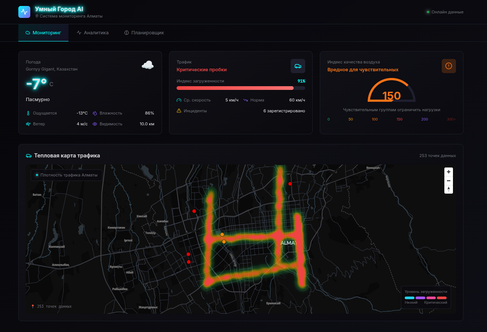
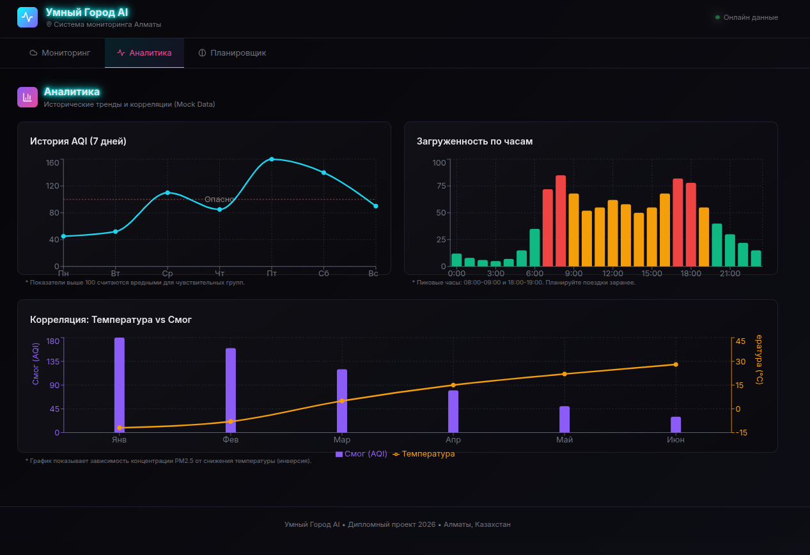
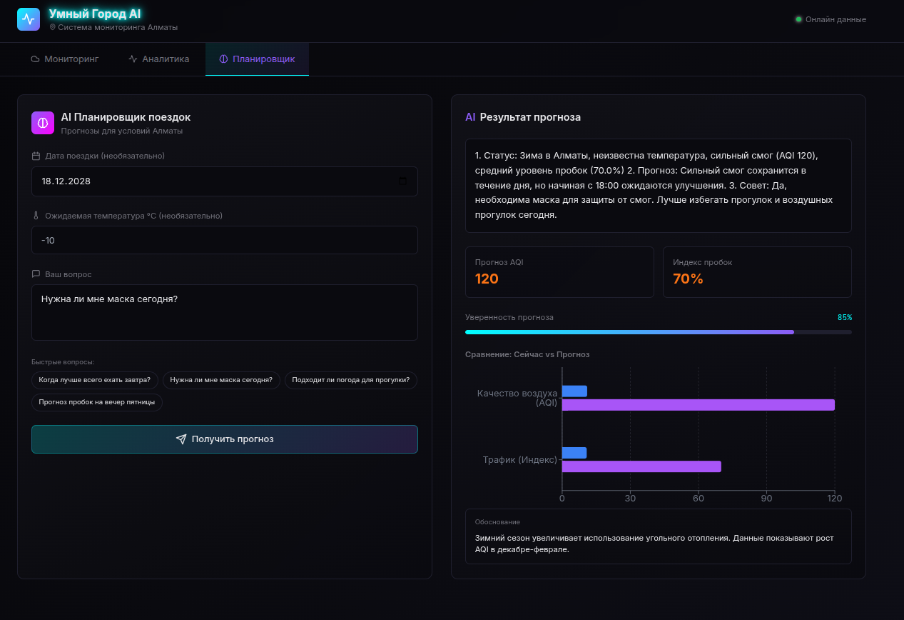

# Smart City AI Core | Almaty Urban Monitoring System

**Умная городская система мониторинга с AI-прогнозами для города Алматы**

Дипломный проект, демонстрирующий интеграцию микросервисной архитектуры, машинного обучения и современных веб-технологий для создания системы мониторинга городской среды.


---

## Содержание

- [Возможности](#возможности)
- [Архитектура](#архитектура)
- [Быстрый старт](#быстрый-старт)
- [Технологии](#технологии)
- [API Документация](#api-документация)
- [Тестирование](#тестирование)
- [CI/CD](#cicd)
- [Разработка](#разработка)
- [Скриншоты](#скриншоты)

---

## Возможности

### Мониторинг в реальном времени
- **Погода** -- температура, ощущается как, влажность, ветер, видимость (Open-Meteo API)
- **Трафик** -- индекс загруженности дорог, средняя скорость, 24 дорожных сегмента, инциденты (TomTom API + Яндекс Карты)
- **Качество воздуха (AQI)** -- расчет EPA 2024 AQI по PM2.5 с цветовой индикацией и рекомендациями

### AI Планировщик поездок
- **Прогнозы на основе Groq LLM** (llama-3.1-8b-instant) -- умные рекомендации для поездок
- **ML-модели** -- GradientBoosting для PM2.5, RandomForest для трафика (70% ML + 30% statistical baseline)
- **Интерактивный чат** -- задавайте вопросы на естественном языке

### Аналитика
- **Качество воздуха за 7 дней** -- Area-график с порогом опасности
- **Пробки по часам суток** -- Bar-график загруженности с цветовой индикацией
- **Сезонный смог: Алматы** -- комбинированный график на основе 2234 дней исторических данных

### Визуализация данных
- **Яндекс Карты** -- интерактивная карта с real-time трафиком Яндекса, наложением TomTom инцидентов и извлечением Яндекс-балла пробок (1-10)
- **Real-time виджеты** -- адаптивный дашборд с киберпанк-дизайном
- **Мультиязычность (RU / EN / KK)** -- полная локализация интерфейса

### Режим работы
- **Mock-данные** -- система работает без API-ключей в демо-режиме (graceful degradation)
- **Реальные данные** -- Open-Meteo (погода, бесплатно), TomTom (трафик), Яндекс Карты (пробки), Groq (LLM)
- **Кэширование** -- погода 5 мин, трафик 15 мин, React Query 30 сек
- **Историческая аналитика** -- 2234 дня реальных данных Алматы (Open-Meteo Archive 2020-2026)
- **Безопасность** -- CORS ограничен, rate limiter (60 req/min), gzip-сжатие, security-заголовки Nginx

---

## Архитектура

```
+------------------+       +------------------+       +------------------+
|   Frontend       |------>|   Backend Go     |------>|  ML Service      |
|  React + Vite    |       |   Fiber API      |       | Python + FastAPI |
|  Яндекс Карты    |       |   Clean Arch     |       | scikit-learn     |
|  Recharts        |       |   PostgreSQL     |       | Groq LLM         |
+------------------+       +------------------+       +------------------+
         |                          |                          |
         |                          v                          |
         |                 +---------------+                   |
         |                 |  PostgreSQL    |                   |
         |                 |   + PostGIS    |                   |
         |                 +---------------+                   |
         |                          |                          |
         |         +----------------+----------------+         |
         |         v                v                v         |
     +--------+ +--------+ +---------------+ +-----------+    |
     |Open-   | |TomTom  | |Яндекс Карты   | |  Groq AI  |<--+
     |Meteo   | |Traffic | |(JS API 2.1)   | |  (LLM)    |
     +--------+ +--------+ +---------------+ +-----------+
```

### Сервисы

| Сервис | Порт | Технология | Назначение |
|--------|------|------------|------------|
| **Frontend** | 3000 | React 18 + TypeScript + Nginx | UI дашборд, карты, аналитика |
| **Backend** | 8080 | Go 1.22 (Fiber) + pgx | API Gateway, бизнес-логика, кэширование |
| **ML Service** | 8000 | Python 3.12 + FastAPI + scikit-learn | AI-прогнозы, ML-модели, статистика |
| **Database** | 5432 | PostgreSQL 15 + PostGIS | Хранение погоды, трафика, прогнозов |

### Внешние API

| Провайдер | Данные | Стоимость | Кэш |
|-----------|--------|-----------|------|
| **Open-Meteo** | Погода + AQI (PM2.5 -> EPA AQI) | Бесплатно, без ключа | 5 мин |
| **TomTom** | Traffic Flow + Incidents v5 | Free-tier (2500/day) | 15 мин |
| **Яндекс Карты** | Real-time пробки (JS API 2.1) | Бесплатно для разработки | ~60 сек |
| **Groq** | LLM (llama-3.1-8b-instant) | Free-tier | Нет |

---

## Быстрый старт

### Требования
- Docker 20.10+
- Docker Compose v2+
- make (опционально)

### 1. Клонируйте репозиторий
```bash
git clone https://github.com/Beksanoff/smart-city-ai
cd smart-city-ai
```

### 2. Настройте переменные окружения
```bash
cp .env.example .env
# Отредактируйте .env если нужны реальные API-ключи
```

### 3. Запустите проект
```bash
# С Make (рекомендуется)
make up

# Или вручную
docker compose up -d --build
```

### 4. Откройте приложение
```
Frontend:    http://localhost:3000
Backend API: http://localhost:8080
ML Service:  http://localhost:8000
```

### Управление проектом
```bash
make up       # Запустить все сервисы
make down     # Остановить все сервисы
make restart  # Перезапустить
make logs     # Просмотр логов
make status   # Статус контейнеров
make clean    # Полная очистка (удалить volumes)
make test     # Запуск всех тестов
make lint     # Проверка кода (ESLint + TypeScript + go vet)
```

---

## Технологии

### Backend (Go 1.22)
- **Fiber** -- высокопроизводительный веб-фреймворк
- **pgx** -- PostgreSQL драйвер
- **Clean Architecture** -- domain -> service -> repository -> delivery
- **Rate Limiter** -- 60 запросов/мин через sliding window
- **Gzip Compression** -- сжатие ответов
- **Concurrent Fetching** -- горутины для параллельного запроса погоды + трафика
- **Graceful Degradation** -- mock-данные при отсутствии API-ключей

### ML Service (Python 3.12)
- **FastAPI** -- асинхронный API
- **scikit-learn** -- GradientBoosting (PM2.5, R²=0.53), RandomForest (трафик, R²=0.77)
- **Groq AI SDK** -- интеграция с LLM (llama-3.1-8b-instant)
- **Pandas + NumPy** -- статистика, корреляции
- **EPA 2024 AQI** -- расчет по PM2.5 с truncation fix для gap в breakpoints
- **Separate Scalers** -- отдельные StandardScaler для PM2.5 и трафика
- **Blended Predictions** -- 70% ML + 30% statistical baseline

### Frontend (React 18)
- **Vite** -- сборщик
- **TypeScript** -- типизация (0 ошибок)
- **TailwindCSS** -- стилизация (киберпанк-тема)
- **TanStack React Query** -- управление серверным состоянием
- **Яндекс Карты JS API 2.1** -- интерактивная карта с real-time трафиком
- **Recharts** -- графики аналитики (Area, Bar, Composed)
- **i18next** -- мультиязычность (RU / EN / KK)
- **Vitest + Testing Library** -- тестирование компонентов

### Infrastructure
- **Docker + Docker Compose** -- контейнеризация (4 сервиса, `restart: unless-stopped`)
- **Nginx** -- reverse proxy, security-заголовки, X-Real-IP
- **PostgreSQL 15 + PostGIS** -- база данных с геопространственными возможностями
- **GitHub Actions** -- CI pipeline (4 jobs)

---

## API Документация

### Backend Endpoints (`:8080`)

| Метод | Endpoint | Описание |
|-------|----------|----------|
| `GET` | `/health` | Health check |
| `GET` | `/api/v1/dashboard` | Агрегированные данные (погода + трафик) |
| `GET` | `/api/v1/weather` | Текущая погода + AQI |
| `GET` | `/api/v1/traffic` | Трафик: 24 сегмента, инциденты, congestion index |
| `GET` | `/api/v1/history/weather?hours=N` | История погоды за N часов (max 720) |
| `GET` | `/api/v1/history/traffic?hours=N` | История трафика за N часов |
| `POST` | `/api/v1/predict` | AI-прогноз (проксируется в ML Service) |
| `GET` | `/api/v1/stats` | Статистика (проксируется в ML Service) |

### ML Service Endpoints (`:8000`)

| Метод | Endpoint | Описание |
|-------|----------|----------|
| `GET` | `/health` | Health check |
| `POST` | `/predict` | AI-прогноз (Groq LLM + ML-модели + статистика) |
| `GET` | `/stats` | Месячные средние, корреляции, данные по 2234 дням |
| `GET` | `/model/info` | Информация о ML-моделях (метрики, дата обучения) |
| `POST` | `/model/retrain` | Переобучение ML-моделей |

### Пример запроса: AI-прогноз
```http
POST /api/v1/predict
Content-Type: application/json

{
  "date": "2026-02-23",
  "temperature": -5,
  "query": "Когда лучше ехать завтра?"
}
```

### Пример ответа
```json
{
  "success": true,
  "data": {
    "prediction": "Рекомендуется выезжать до 07:30 или после 20:00...",
    "confidence_score": 0.91,
    "aqi_prediction": 62,
    "traffic_index_prediction": 30.8,
    "reasoning": "На основе анализа 2234 исторических записей...",
    "is_mock": false
  }
}
```

---

## Тестирование

### Go Backend -- 32 теста
```bash
cd backend-go && go test ./... -v
```
- Table-driven тесты для `pm25ToAQI()`: граничные значения, монотонность, все диапазоны EPA
- Покрытие: расчет AQI от 0 до 500+

### Python ML Service -- 36 тестов
```bash
cd ml-python && python -m pytest tests/ -v
```
- Unit-тесты для EPA AQI расчета (все 7 категорий)
- Тесты API: `/health`, `/predict` валидация входных данных
- Тесты edge cases: нулевые значения, пустые строки, экстремальные PM2.5

### Frontend React -- 7 тестов
```bash
cd frontend-react && npx vitest run
```
- Рендеринг заголовка и навигации
- Переключение вкладок (Мониторинг, Аналитика, Планировщик)
- Переключатель языка (RU/EN/KK)
- Наличие footer

### Запуск всех тестов
```bash
make test
```

---

## CI/CD

Проект использует **GitHub Actions** с 4 параллельными jobs:

| Job | Что проверяет |
|-----|---------------|
| **Go Tests** | `go test ./...` на Go 1.22 |
| **Python Tests** | `pytest` на Python 3.12 |
| **Frontend** | ESLint + TypeScript `--noEmit` + Vitest |
| **Docker Build** | Сборка всех 4 контейнеров |

Файл конфигурации: `.github/workflows/ci.yml`

CI запускается при push и pull request в `main`.

---

## Разработка

### Локальный запуск без Docker

#### Backend (Go)
```bash
cd backend-go
go mod download
go run cmd/server/main.go
```

#### ML Service (Python)
```bash
cd ml-python
python -m venv venv
source venv/bin/activate
pip install -r requirements.txt
uvicorn main:app --reload --port 8000
```

#### Frontend (React)
```bash
cd frontend-react
npm install
npm run dev
```

### Структура проекта
```
antigravity_smartcity/
├── .github/workflows/       # CI/CD (GitHub Actions)
│   └── ci.yml
├── backend-go/              # Go API Gateway
│   ├── cmd/server/          # Точка входа (main.go)
│   ├── internal/
│   │   ├── domain/          # Доменные сущности и интерфейсы
│   │   ├── repository/      # PostgreSQL + Mock реализации
│   │   ├── service/         # Бизнес-логика + тесты
│   │   └── delivery/http/   # HTTP handlers + router
│   └── pkg/utils/           # Утилиты (haversine, clamp, lerp)
├── ml-python/               # ML Микросервис
│   ├── main.py              # FastAPI приложение
│   ├── services/
│   │   ├── logic.py         # Прогнозирование, Groq LLM
│   │   ├── ml_model.py      # scikit-learn модели, EPA AQI
│   │   └── forecast.py      # Получение прогнозов из Open-Meteo
│   ├── tests/               # Pytest тесты (36 шт.)
│   ├── models/              # Обученные модели (.pkl, в .gitignore)
│   ├── data/                # almaty_history.csv (2234 дня)
│   └── tools/               # Скрипты генерации данных
├── frontend-react/          # React UI
│   ├── src/
│   │   ├── components/
│   │   │   ├── dashboard/   # WeatherWidget, TrafficWidget, AQI, TripPlanner
│   │   │   ├── analytics/   # AQIHistoryChart, TrafficByHourChart, CorrelationChart
│   │   │   └── map/         # AlmatyMap (Яндекс Карты)
│   │   ├── __tests__/       # Vitest тесты (7 шт.)
│   │   ├── locales/         # ru.ts, en.ts, kk.ts
│   │   ├── services/api.ts  # API клиент + fallback mock
│   │   └── i18n.ts          # Настройка i18next
│   └── nginx.conf           # Nginx конфигурация
├── migrations/              # 001_init.sql (PostGIS + таблицы)
├── docker-compose.yml       # 4 сервиса
├── Makefile                 # Команды управления (test, lint, up, down...)
├── .env.example             # Шаблон переменных окружения
└── README.md
```

---

## Скриншоты

### Дашборд мониторинга


### Карта трафика Алматы


### AI Планировщик


---

## API-ключи (опционально)

Проект работает **без API-ключей** в демо-режиме с mock-данными. Для реальных данных:

| Сервис | Регистрация | Переменная в `.env` | Примечание |
|--------|-------------|---------------------|------------|
| **TomTom** | https://developer.tomtom.com | `TOMTOM_API_KEY` | Трафик + инциденты (free-tier 2500 req/day) |
| **Яндекс Карты** | https://developer.tech.yandex.ru | `YANDEX_MAPS_API_KEY` | Real-time пробки на карте |
| **Groq AI** | https://console.groq.com | `GROQ_API_KEY` | LLM-прогнозы |

> **Примечание:** Погода и AQI получаются через **Open-Meteo** (бесплатно, без ключа).

---

## Лицензия

MIT License - смотрите файл [LICENSE](LICENSE)

---

## Авторы
- @beksanov
- @marlen_berdan
- @xtasidi
- @kurbanovbakhtiyar
- @ske11e

**Дипломный проект 2026**
- Университет: META University
- Город: Алматы, Казахстан

---

## Благодарности

- [Open-Meteo](https://open-meteo.com) -- бесплатный API погоды и качества воздуха
- [TomTom](https://developer.tomtom.com) -- API трафика и инцидентов
- [Яндекс Карты](https://yandex.ru/maps) -- карты и real-time пробки
- [Groq](https://groq.com) -- AI-инфраструктура (LLM)

---

**Сделано для улучшения городской среды Алматы**
